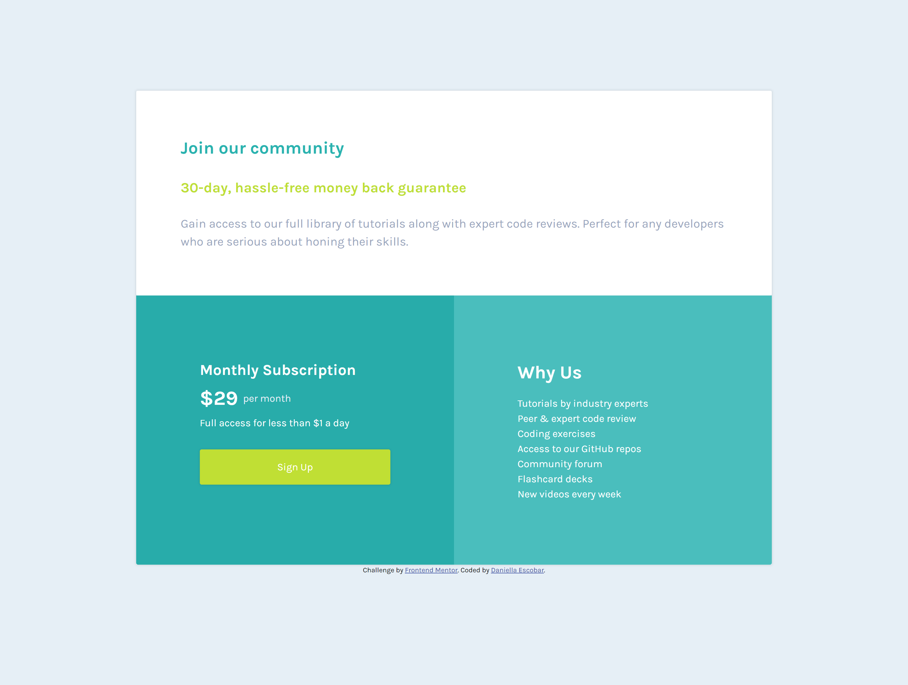

# Frontend Mentor - Single price grid component solution

This is a solution to the [Single price grid component challenge on Frontend Mentor](https://www.frontendmentor.io/challenges/single-price-grid-component-5ce41129d0ff452fec5abbbc). Frontend Mentor challenges help you improve your coding skills by building realistic projects.

## Table of contents

- [Overview](#overview)
  - [The challenge](#the-challenge)
  - [Screenshot](#screenshot)
  - [Links](#links)
- [My process](#my-process)
  - [Built with](#built-with)
  - [What I learned](#what-i-learned)
  - [Continued development](#continued-development)
  - [Useful resources](#useful-resources)
- [Author](#author)
- [Acknowledgments](#acknowledgments)

## Overview

### The challenge

Users should be able to:

- View the optimal layout for the component depending on their device's screen size
- See a hover state on desktop for the Sign Up call-to-action

### Screenshot



### Links

- Solution URL: [Challenge](https://www.frontendmentor.io/challenges/single-price-grid-component-5ce41129d0ff452fec5abbbc)
- Live Site URL: [My Solution](https://daniellaescobar.github.io/single-price-grid-component/)

## My process

### Built with

- Semantic HTML5 markup
- CSS custom properties
- Flexbox
- CSS Grid
- Mobile-first workflow

### What I learned

It's been a few months since I've coded a project rather than just designed it, so working on this has been a great refresher for me. At first, I wasn't sure how to go about switching the layout from a column in the mobile view to having the top portion extend out and the two blue sections in a row below it. I decided on making a div for the two blue portions that I would then give a flex direction of row with the following code:

```html
<div class="row">
  <section class="monthly">
    <h2>Monthly Subscription</h2>
    <div class="money">
      <h3>&dollar;29</h3>
      <p>per month</p>
    </div>
    <!--closing div for money-->
    <p>Full access for less than &dollar;1 a day</p>
    <a href="#">Sign Up</a>
  </section>

  <section class="why">
    <h2>Why Us</h2>
    <div class="bullets">
      <p>Tutorials by industry experts</p>
      <p>Peer &amp; expert code review</p>
      <p>Coding exercises</p>
      <p>Access to our GitHub repos</p>
      <p>Community forum</p>
      <p>Flashcard decks</p>
      <p>New videos every week</p>
    </div>
  </section>
</div>
```

```css
@media (min-width: 800px) {
  .row {
    flex-direction: row;
    width: 100%;
    height: 100%;
  }
```

### Continued development

I would love to continue working with flexbox and combining it with grid. In a previous web development class I took, it was always a requirement to utilize both flexbox and grid when creating layouts, so I would like to review those concepts again.

### Useful resources

- [Interneting Is Hard: Flexbox](https://internetingishard.netlify.app/html-and-css/flexbox/index.html) - This is a great website that's very beginner friendly that helped me learn Flexbox!

## Author

- Website - [Daniella Escobar](https://descobar0303.wixsite.com/my-site)
- Frontend Mentor - [@daniellaescobar](https://www.frontendmentor.io/profile/daniellaescobar)

## Acknowledgments

I would really like to thank my professor, Andrew Sipes, for his help working on this project! It's been so much fun to take a course where I'm not only designing, but developing and making my ideas come to life.
